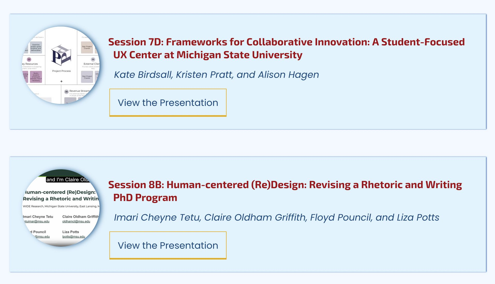

# THEME FOR SIGDOC CONFERENCES

This repo is for the SIG on the Design of Communication conference.

## Custom Blocks

Custom blocks are located in the `gutenberg > blocks` folder area.

Current blocks include:

- **Flexbox thin cards** <br> 
	- **Path**: `gutenberg/blocks/sigcon-cards-flex-thin`
	- **Notes**: Main CSS styles are located in a shared cards stylesheet: `gutenberg/blocks_shared_css_and_js/css/sigcon-cards.scss`
- **Cards with left floated images** <br> 
	- **Path**: `gutenberg/blocks/sigcon-cards-left-float-img-and-txt`
	- **Notes**: It's frontend.scss file overwrites WP's `tr-image-...` styles

## GUTENBERG BLOCK LESSONS LEARNED

- `model.json` keys **must use** underscores—not hyphens. Otherwise it breaks the JSON.
- anchors can nicely use the `link` object with the `tr_a()` template part. But, the trade off is not as much CSS versatility without adding classes to the anchor element itself.

## TASKS

### Block Templating

Custom Gutenberg blocks (`theme-sigcon/gutenberg/blocks/..`)

- [] `enter_name_of_block`: Enter description of block component
	- [] editor.scss
	- [] view.latte
	- [] frontend.scss
	- [] frontend.js
	- [] model.json
	- [] example.jpg

## **Environment Requirements:**

- PHP ^8.0 (^7.4.29 for releases prior to v1.1.0)
- Composer 2.0.2^
- Node 14.19.1

---

## SETUP

1. At the root of the theme, there is a “theme_redone_global_config.json” file. Replace “localhost/theme-redone” with the name of your project from htdocs “localhost/[PROJECT-FOLDER-NAME]” (This makes sure browser-sync connects to the correct project)
2. From the terminal (from inside the root directory of the theme) run `composer install`.
3. Run `npm install` to install the PHP and JS dependencies. (Make sure Node version 14.19.1 is used. We suggest using NVM to manage Node versions)
    - **NOTE**: On an M1 chip, I used `yarn install` instead. `node-sass` kept breaking due to lack of M1 ARM64 support. First, I 
        1. ran `yarn add sass gulp-sass --save-dev`, which properly installed allthethings. Then,
        2. in the `gulpfile.js`, I updated the `sass` library reference to `const sass = require("gulp-sass")(require('sass'))`.
4. Install the TRB CLI package globally ( `npm i -g @webredone/trb-cli` ) to scaffold blocks faster.
5. In WordPress, activate the theme
6. If you want to enable SVG uploads to the media folder, install the svg-support plugin
7. To start the compiler and make it watch for file changes, simply run the `npm start command` from the terminal
8. Once the project is finished and ready to be deployed, run `npm run build:prod` to optimize CSS and javascript files.

## ARCHITECTURE

```
.
├── assets
│   ├── img
│   └── svg
├── cptui
│   ├── post_types.php
│   └── taxonomies.php
├── gutenberg
│   ├── blocks
│   │   ├── new-block-blueprint
│   │   │   ├── _editor.scss
│   │   │   ├── controller.php
│   │   │   ├── EditMain.js
│   │   │   ├── EditSidebar.js
│   │   │   ├── example.jpg
│   │   │   ├── frontend.js
│   │   │   ├── frontend.scss
│   │   │   ├── model.json
│   │   │   ├── View.js
│   │   │   └── view.latte
│   ├── blocks_shared_css_and_js
│   │   ├── css
│   │   └── js
│   ├── components
│   ├── core
│   ├── helpers
│   ├── scss
│   ├── blocks.js
│   ├── init.php
│   └── register_block.js
├── page-templates
├── php-inc
├── prod
├── src
│   ├── js
│   └── scss
├── vendor
├── views
│   ├── layout
│   ├── parts
│   ├── temp
│   └── templates
├── 404.php
├── front-page.php
├── functions.php
├── index.php
├── page.php
├── screenshot.png
├── single.php
├── style.css
└── theme_redone_global_config.json
```

### Modifications

- `gutenberg/init.php` - needed to check for .DS_Store as a directory
```
// REGISTER THE DYNAMIC BLOCKS ------------------------------
$block_prefix = json_decode(file_get_contents(get_template_directory() . "/theme_redone_global_config.json"), true)['BLOCK_NAME_PREFIX'];
$all_blocks_dir_names = array_diff(scandir(TR_BLOCKS_DIR), ['..', '.', 'new-block-setup']);
foreach ($all_blocks_dir_names as $key => $block_dir_name) {
	if ($block_dir_name != '.DS_Store') {

		$block_model = json_decode(file_get_contents(TR_BLOCKS_DIR . "/$block_dir_name/model.json"), true);
		$block_meta = $block_model['block_meta'];
		if (
			!array_key_exists("isJsRendered", $block_meta) || 
			(array_key_exists("isJsRendered", $block_meta) && $block_meta['isJsRendered'] === false)
		) {
			require_once TR_BLOCKS_DIR . "/$block_dir_name/controller.php";
		}

	}
	
}
// END:REGISTER THE DYNAMIC BLOCKS --------------------------
```

---

## **Compilation/Watching and Bundling/Minification Tasks:**

- To start the compiler and make it watch for file changes, simply run the npm start command from the terminal
- Once the project is finished and ready to be deployed, run npm run build:prod to optimize css and javascript files.
__________________________________________________________________________

Theme Redone is a custom WordPress theme starter/framework with its own Gutenberg blocks solution and a CLI that speeds up the block creation process.

### It consists of:

- ✅ [Latte templating engine](https://webredone.com/theme-redone/why-latte-as-a-templating-engine/) for its beautiful syntax and a more streamlined and manageable workflow
- ✅ EsBuild/Webpack + Gulp task tasks for [compiling SCSS and JS](https://webredone.com/theme-redone/scss-and-js-compilation-bundling/)
- ✅ SCSS (SMACSS folder/files structure)
- ✅ Javascript (ES8 and React/Svelte/Vue support, thanks to EsBuild and Babel)
- ✅ In-theme [framework for building Gutenberg blocks](https://webredone.com/theme-redone/gutenberg-blocks-framework/) in a streamlined and standardized way
- ✅ [TRB CLI](https://webredone.com/theme-redone/gutenberg-blocks-framework/trb-cli/) helper for scaffolding new Gutenberg blocks
- ✅ [Bare-bones grid system](https://webredone.com/theme-redone/simple-grid-system/) coded with Flex and CSS variables (about 15 lines of code)
- ✅ [Helper functions](https://webredone.com/theme-redone/theme-functions/) for repetitive tasks such as rendering images, links, SVG code, and more
- ✅ Just a few [well-written UI components](https://webredone.com/theme-redone/javascript-ui-elements-classes/) to get you started (we don’t like bloat in our code): Modal, Accordion, Tabs, Menu, Dropdowns, Sliders, and simple “in view fade-in transitions”
- ✅ [SVG support](https://webredone.com/theme-redone/svg-handling/)
- ✅ [Tracy Debugger](https://webredone.com/theme-redone/debugging-tracy/) to help us make sure we write stable and error-free code
- ✅ And much more

### Visit https://webredone.com/theme-redone/ to learn more from our 50+ pages long documentation.

---

## **Environment Requirements:**

- PHP ^8.0 (^7.4.29 for releases prior to v1.1.0)
- Composer 2.0.2^
- Node 14.19.1

---

## **Installation:**

1. Download and install the latest version of the theme
2. At the root of the theme, there is a “theme_redone_global_config.json” file. Replace “localhost/theme-redone” with the name of your project from htdocs “localhost/[PROJECT-FOLDER-NAME]” (This makes sure browser-sync connects to the correct project)
3. From the terminal (from inside the root directory of the theme) run composer install and afterward npm install to install the PHP and JS dependencies. (Make sure Node version 14.19.1 is used. We suggest using NVM to manage Node versions)
   Install the TRB CLI package globally ( npm i -g @webredone/trb-cli ) to scaffold blocks faster.
4. In WordPress, activate the theme

---

## **Compilation/Watching and Bundling/Minification Tasks:**

- To start the compiler and make it watch for file changes, simply run the npm start command from the terminal
- Once the project is finished and ready to be deployed, run npm run build:prod to optimize css and javascript files.
