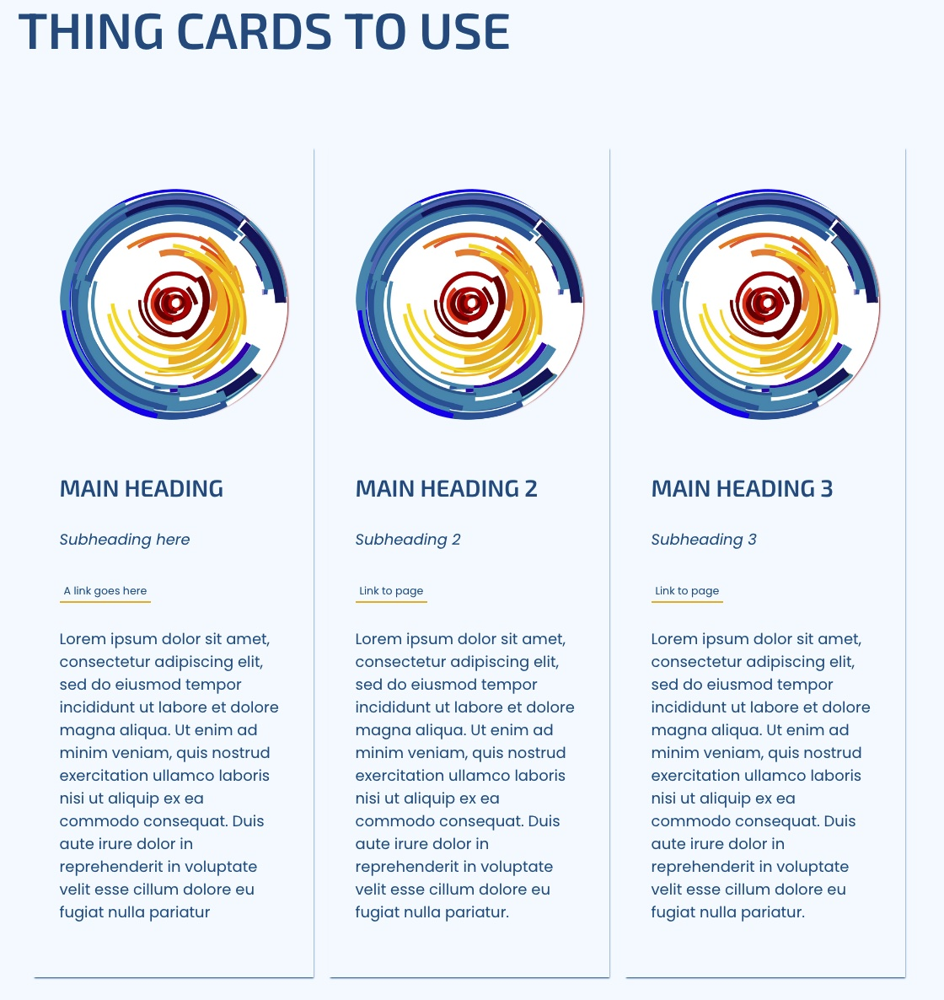
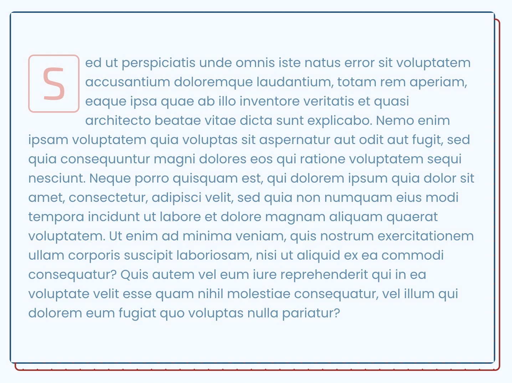

# THEME FOR SIGDOC CONFERENCES

This repo is for the SIG on the Design of Communication conference.

## CUSTOM LAYOUTS

### Schedule / Program


Use this layout for the SIGDOC program page.

#### Features

- Programmatic population of schedule via CSV file: [/prod/global/vendor/sigdoc-schedule.csv](/prod/global/vendor/sigdoc-schedule.csv).
- Schedule filtering via searchbar

#### WP theme development files

- **Template**: [views/templates/template-schedule.latte](/views/templates/template-schedule.latte)
- **Custom Includes**:
  - [/layout/header-schedule](/views/layout/header-schedule)
- **CSS**:
    - [src/scss/theme/pages/_schedule.scss](src/scss/theme/pages/_schedule.scss)
- **JS**:
    - [/prod/global/vendor/schedule.js](/prod/global/vendor/schedule.js)
- **Notes**: Main CSS styles are located in a shared cards stylesheet: `gutenberg/blocks_shared_css_and_js/css/sigcon-cards.scss`

## CUSTOM CONTENT BLOCKS

Custom blocks are located in the `gutenberg > blocks` folder area.

### Flexbox animated and numbered card panels


Use to add important attendee actions on the landing page as the conference preparations advance throughout the year. Actions are rendered in reverse order to priortize the current action item of importance.

1. Read the CFP
2. Decide which type of proposal
3. Submit a proposal
4. Review proposals
5. Submit to proceedings
6. Review proceedings
7. Register for the conference
8. Review the program
9. Policies against harrassment
10. Keynotes

- **Path**: `gutenberg/blocks/sigcon-landing-cards-flexrow`
- **Notes**: Uses Greensock.js library for the animations. However, it is designed to not require Greensock or javascript in general.

### Landing page animated and numbered card panels


Alternative landing page block for attendee action items that are animated and linked with a line pathway. Please note, however, this block is only designed to accommodate up to 5 tasks. And, any more than that makes the page too long for easy reading comprehension / a good user experience.

- **Path**: [/gutenberg/blocks/sigcon-landing-cards](/gutenberg/blocks/sigcon-landing-cards)
- **Notes**: Uses Greensock.js library for the animations. However, it is designed to not require Greensock or javascript in general.

### Intro card for a page


Good to use as the first paragraph on a page for the most important info. Put your top content priorities in here.

- **Path**: [/gutenberg/blocks/sigcon-page-intro-card](/gutenberg/blocks/sigcon-page-intro-card)
- **Notes**: Includes a built-in "Meet the committee" section, but you can ignore it since it is optional.

### Flexbox thin cards



Good for bios about speakers or series of related content that needs a featured image.

- **Path**: [gutenberg/blocks/sigcon-cards-flex-thin](gutenberg/blocks/sigcon-cards-flex-thin)
- **Notes**: Main CSS styles are located in a shared cards stylesheet: [gutenberg/blocks_shared_css_and_js/css/sigcon-cards.scss](gutenberg/blocks_shared_css_and_js/css/sigcon-cards.scss).

### Cards with left floated images


Good for bios about speakers or series of related content that needs a featured image.

- **Path**: [/gutenberg/blocks/sigcon-cards-left-float-img-and-txt](/gutenberg/blocks/sigcon-cards-left-float-img-and-txt)
- **Notes**: It's frontend.scss file overwrites WP's `tr-image-...` styles.

### Featured paragraph with styled first letter



Good for first paragraph chunk on a longer content page. Use sparingly.

- **Path**: [/gutenberg/blocks/sigcon-page-card-paragraph-feature](/gutenberg/blocks/sigcon-page-card-paragraph-feature)
- **Notes**:

### Searchable cards for a workshops

Custom content inputs so we can feature workshops on the site. Each item is collapsible and filterable via a searchbar at the top.


- **Path**: [/gutenberg/blocks/sigcon-workshops-collapsible-filterable](/gutenberg/blocks/sigcon-workshops-collapsible-filterable)
- **Notes**: Currently does not hide some headings, such as References, if not used.

### Cards for a posters

Custom content inputs so we can feature poster presentations on the site.


- **Path**: [/gutenberg/blocks/sigcon-poster-session-cards](/gutenberg/blocks/sigcon-poster-session-cards)
- **Notes**:

### Accessible landmark section regions of content

Create accessbile landmarks to break up larger/longer pages of content.


**Path**: `gutenberg/blocks/sigcon-section-content`

**Notes**:

### Sponsors Gallery

Create a gallery of sponsor logos, where each logo can be provided a URL to their desired site.


**Path**: `gutenberg/blocks/sigcon-sponsor-gallery`

**Notes**:

## THEME REDONE & GUTENBERG BLOCK LESSONS LEARNED

- `model.json` keys **must use** underscores—not hyphens. Otherwise it breaks the JSON.
- anchors can nicely use the `link` object with the `tr_a()` template part. But, the trade off is not as much CSS versatility without adding classes to the anchor element itself.
- Needed to modify Theme Redone's [/gutenberg/init.php](/gutenberg/init.php) because I needed to check for `.DS_Store` as a directory. Otherwise, if left unchecked, the building process would fail.
  ```
  // REGISTER THE DYNAMIC BLOCKS ------------------------------
  $block_prefix = json_decode(file_get_contents(get_template_directory() . "/theme_redone_global_config.json"), true)['BLOCK_NAME_PREFIX'];
  $all_blocks_dir_names = array_diff(scandir(TR_BLOCKS_DIR), ['..', '.', 'new-block-setup']);
  foreach ($all_blocks_dir_names as $key => $block_dir_name) {
    if ($block_dir_name != '.DS_Store') {

      $block_model = json_decode(file_get_contents(TR_BLOCKS_DIR . "/$block_dir_name/model.json"), true);
      $block_meta = $block_model['block_meta'];
      if (
        !array_key_exists("isJsRendered", $block_meta) ||
        (array_key_exists("isJsRendered", $block_meta) && $block_meta['isJsRendered'] === false)
      ) {
        require_once TR_BLOCKS_DIR . "/$block_dir_name/controller.php";
      }

    }

  }
  // END:REGISTER THE DYNAMIC BLOCKS --------------------------
  ```

### Block Templating

Custom Gutenberg blocks (`/gutenberg/blocks/..`)

- [] `enter_name_of_block`: Enter description of block component
	- [] editor.scss
	- [] view.latte
	- [] frontend.scss
	- [] frontend.js
	- [] model.json
	- [] example.jpg

## Programming Environment Requirements

- PHP ^8.0 (^7.4.29 for releases prior to v1.1.0)
	- This theme runs on PHP ^8.0
- Composer 2.0.2^
- Node 14.19.1
  - [Installation instructions](./node.md)

### Suggested Development Tools

- [Local](https://localwp.com/): A great Wordpress devtool that helps you run a full WP environment locally on your computer to test before deploying any new changes.
- VS Code: Great free code editor
- Github Desktop: To help version control management.

---

## DEV ENVIRONMENT SETUP

1. Install PHP, Node, and Composer.
2. At the root of the theme, there is a “theme_redone_global_config.json” file. Replace “localhost/theme-redone” with the name of your project from htdocs “localhost/[PROJECT-FOLDER-NAME]” (This makes sure browser-sync connects to the correct project)
3. From the terminal (from inside the root directory of the theme) run `composer install`.
4. Run `npm install` to install the PHP and JS dependencies. (Make sure Node version 14.19.1 is used. We suggest using NVM to manage Node versions)
    - **NOTE**: On an M1 chip, I used `yarn install` instead. `node-sass` kept breaking due to lack of M1 ARM64 support. First, I 
        1. ran `yarn add sass gulp-sass --save-dev`, which properly installed allthethings. Then,
        2. in the `gulpfile.js`, I updated the `sass` library reference to `const sass = require("gulp-sass")(require('sass'))`.
5. Install the TRB CLI package globally ( `npm i -g @webredone/trb-cli` ) to scaffold blocks faster.
6. In WordPress, activate the theme.
7. If you want to enable SVG uploads to the media folder, install the svg-support plugin.


## Compilation, Watching + Bundling & Minification Tasks

1. To start the compiler and make it watch for file changes, simply run the `npm start command` from the terminal.
2. Create or revise blocks/theme.
3. Once the project is finished and ready to be deployed, run `npm run build:prod` to optimize CSS and JavaScript files.
4. Commit and push changes to github repo: [SIGDOC/theme-sigcon](https://github.com/SIGDOC/theme-sigcon).

## ARCHITECTURE

```
.
├── assets
│   ├── img
│   └── svg
├── cptui
│   ├── post_types.php
│   └── taxonomies.php
├── gutenberg
│   ├── blocks
│   │   ├── new-block-blueprint
│   │   │   ├── _editor.scss
│   │   │   ├── controller.php
│   │   │   ├── EditMain.js
│   │   │   ├── EditSidebar.js
│   │   │   ├── example.jpg
│   │   │   ├── frontend.js
│   │   │   ├── frontend.scss
│   │   │   ├── model.json
│   │   │   ├── View.js
│   │   │   └── view.latte
│   ├── blocks_shared_css_and_js
│   │   ├── css
│   │   └── js
│   ├── components
│   ├── core
│   ├── helpers
│   ├── scss
│   ├── blocks.js
│   ├── init.php
│   └── register_block.js
├── page-templates
├── php-inc
├── prod
├── src
│   ├── js
│   └── scss
├── vendor
├── views
│   ├── layout
│   ├── parts
│   ├── temp
│   └── templates
├── 404.php
├── front-page.php
├── functions.php
├── index.php
├── page.php
├── screenshot.png
├── single.php
├── style.css
└── theme_redone_global_config.json
```

---

## WHAT IS THEME REDONE?

Theme Redone is a custom WordPress theme starter/framework with its own Gutenberg blocks solution and a CLI that speeds up the block creation process.

### TR Features

- ✅ [Latte templating engine](https://webredone.com/theme-redone/why-latte-as-a-templating-engine/) for its beautiful syntax and a more streamlined and manageable workflow
- ✅ EsBuild/Webpack + Gulp task tasks for [compiling SCSS and JS](https://webredone.com/theme-redone/scss-and-js-compilation-bundling/)
- ✅ SCSS (SMACSS folder/files structure)
- ✅ Javascript (ES8 and React/Svelte/Vue support, thanks to EsBuild and Babel)
- ✅ In-theme [framework for building Gutenberg blocks](https://webredone.com/theme-redone/gutenberg-blocks-framework/) in a streamlined and standardized way
- ✅ [TRB CLI](https://webredone.com/theme-redone/gutenberg-blocks-framework/trb-cli/) helper for scaffolding new Gutenberg blocks
- ✅ [Bare-bones grid system](https://webredone.com/theme-redone/simple-grid-system/) coded with Flex and CSS variables (about 15 lines of code)
- ✅ [Helper functions](https://webredone.com/theme-redone/theme-functions/) for repetitive tasks such as rendering images, links, SVG code, and more
- ✅ Just a few [well-written UI components](https://webredone.com/theme-redone/javascript-ui-elements-classes/) to get you started (we don’t like bloat in our code): Modal, Accordion, Tabs, Menu, Dropdowns, Sliders, and simple “in view fade-in transitions”
- ✅ [SVG support](https://webredone.com/theme-redone/svg-handling/)
- ✅ [Tracy Debugger](https://webredone.com/theme-redone/debugging-tracy/) to help us make sure we write stable and error-free code
- ✅ And much more

Visit [https://webredone.com/theme-redone/](https://webredone.com/theme-redone/) to learn more.
